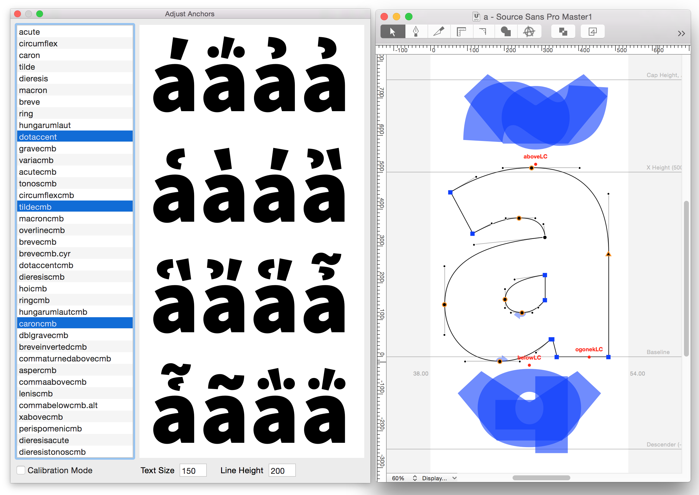

# Extensions for RoboFont
Assortment of extensions for [RoboFont](http://doc.robofont.com/).

## Installation
1. Download the [ZIP package](https://github.com/adobe-type-tools/robofont-extensions/archive/master.zip) and unzip it.
2. Double-click on the extension file(s).

**Alternatively, these extensions can be installed via [Mechanic](http://www.robofontmechanic.com/).**

# Adjust Anchors
This extension lets you preview all of the base + mark glyph combinations, and gives you live feedback during the repositioning of the anchors.
It requires the font to have the anchors already in place and properly setup.

